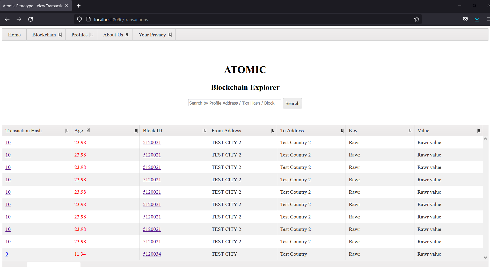

# ATOMIC blockchain explorer and blockchain prototype
Prototype for GovHack 2021, Australia

This project will try and build Citizen’s Trust in this Digital World 
using a blockchain approach to store key-value items with access control
to show who is allowed access to what type of granular data.

This project in it's proof-of-concept stage and utilises Tasmanian Heritage data by collecting it and storing it 
using a blockchain technology. 
The data provides a list of the permanent and provisional entries on the Tasmanian Heritage Register by name and address.

The prototype includes a blockchain explorer website that show blocks and transactions and shows key-value pairs 
stored by authoritive data verifiers.

The blockchain explorer website communicates with an underlying blockchain program written in Go.

We extracted data from the heritage register entries dataset and cleaned it up to use it 
as a test case for our blockchain to see if it was possible to digitise this type of data on the blockchain.
Here is the dataset we used: 

Heritage.tas.gov.au. 2021. Tasmanian Heritage Register Entries as at January 2021. [online] Available at: <https://heritage.tas.gov.au/Documents/THROnline_Jan2021.pdf> [Accessed 22 August 2021].

This PDF document provides a list of the permanent and provisional entries on the Tasmanian Heritage Register by name and address. 

# Prerequisites 

Go version 1.17

Install instructions: https://golang.org/doc/install

# Starting Web Server and blockchain node

To start the web server:

$ go run server.go

To start the blockchain:

$ cd blockchain

$ go run blockchain.go

In your browser navigate to http://localhost:8090
